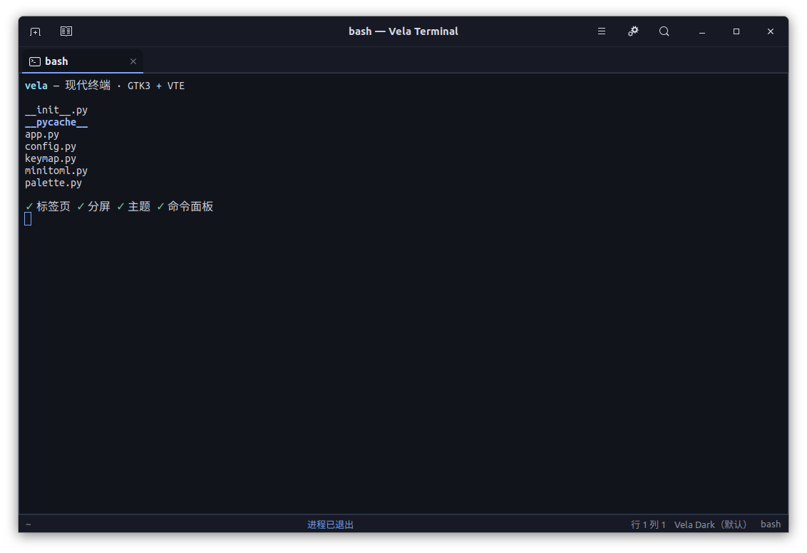
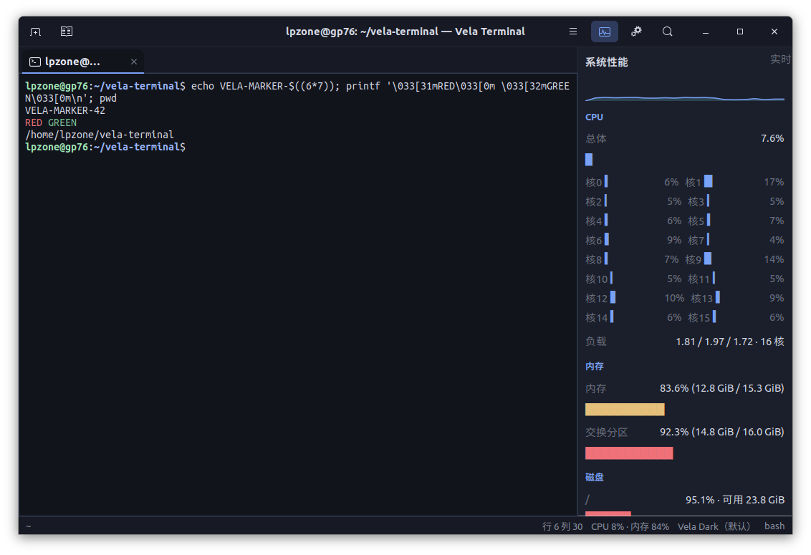
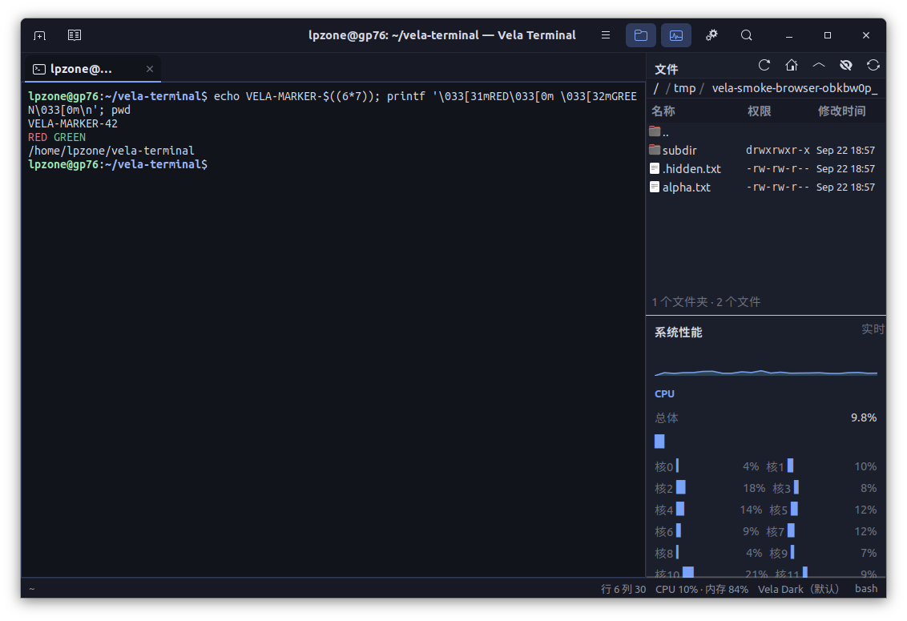
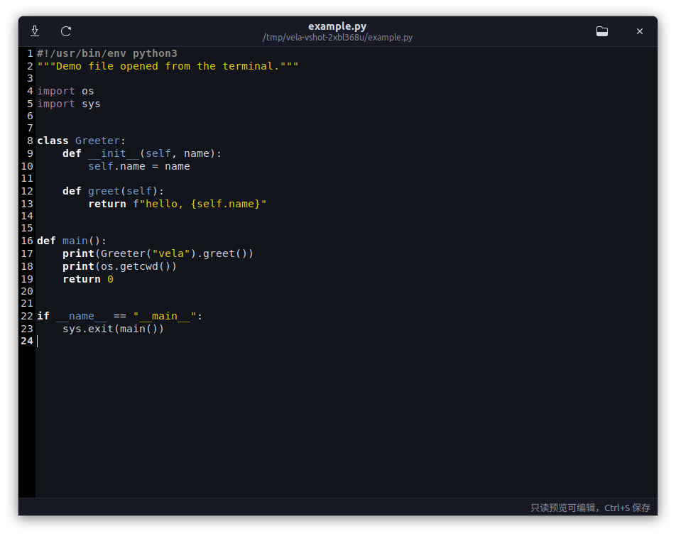

# Vela Terminal

一个面向 Ubuntu 20.04 的现代终端模拟器：具备当下主流终端的常用功能，并且好看。

基于 **GTK 3 + VTE 2.91**（GNOME Terminal、Tilix、Terminator 使用的同一终端内核），
因此 PTY、UTF-8、真彩、鼠标上报、超链接、中文输入法、括号粘贴等底层能力直接来自成熟引擎；
Vela 自己实现的是界面与交互层。









## 功能

| 分类 | 能力 |
| --- | --- |
| 标签页 | 新建/关闭/重排/拖动、标题自动跟随 shell、重新打开已关闭的标签页、批量关闭确认 |
| 分屏 | 左右/上下分屏、无限嵌套、方向键在分屏间跳转、最大化当前分屏、拖拽调整比例 |
| 分屏退出 | 在分屏里输入 `exit` 关闭该分屏；最后一个分屏则关标签页；最后一个标签页则关窗口（异常退出码会保留分屏） |
| 命令面板 | `Ctrl+Shift+P` 模糊搜索全部动作、主题与快捷键提示 |
| 搜索 | `Ctrl+Shift+F` 全文搜索，支持正则、上/下一个、环绕查找 |
| 主题 | **34 套内置配色** + 跟随系统亮暗，实时切换，无需重启 |
| 字体 | 从系统实际安装的等宽字体中选择、实时预览、中英文分别指定、行高列宽微调，可一键下载编程字体 |
| 终端能力 | 真彩、Nerd 图标、emoji、CJK 宽字符、鼠标事件、括号粘贴、IME 中文输入、超链接（Ctrl+点击） |
| 剪贴板 | 复制/粘贴、粘贴为转义文本、选中即复制（可选） |
| 其他 | 回滚缓冲、光标形状/闪烁、视觉/声音响铃、状态栏（目录/行号列号/分屏数/主题） |
| 系统性能 | 侧边面板：CPU 总体/每核 + 历史曲线、负载、内存/交换、磁盘、网卡实时速率、进程数、Vela 自身占用；状态栏同步显示 CPU/内存 |
| 打开文件 | Ctrl+点击终端里的路径直接打开；文本/代码用语法高亮查看器（可编辑、可保存），图片用内置预览（缩放/适应窗口），目录交给文件管理器 |
| 文件面板 | 侧栏内置文件浏览：面包屑路径、名称/权限/修改时间三列、`..` 返回上级、文件夹与文件图标、隐藏文件开关；默认跟随终端 `cd` |
| 配置 | TOML 配置文件、热重载、全部快捷键可改、未知字段保留 |
| 桌面集成 | `.desktop` 菜单项、SVG 图标、可注册为系统默认终端 |

## 快速开始

无需安装，直接在源码目录运行：

```bash
./run.sh
```

安装到当前用户（`~/.local`，不需要 sudo）：

```bash
./install.sh
vela
```

卸载：

```bash
./install.sh --uninstall
```

## 依赖

Ubuntu 20.04 桌面版已自带全部依赖，无需联网安装。若为精简系统：

```bash
sudo apt install python3-gi gir1.2-gtk-3.0 gir1.2-vte-2.91
```

不需要 pip、npm、Rust 或编译步骤。

## 命令行

```bash
vela                                # 启动
vela --working-directory ~/project  # 指定初始目录
vela -e htop                        # 直接执行命令
vela --title "部署"                 # 指定首个标签页标题
vela --maximize                     # 最大化启动
vela --theme nord                   # 临时指定主题
vela --no-headerbar                 # 隐藏标题栏（平铺窗口管理器）
vela --list-themes                  # 列出主题
vela --print-config                 # 打印当前生效配置
vela --check-config                 # 校验配置文件
vela --version
```

## 快捷键

| 操作 | 快捷键 |
| --- | --- |
| 新建标签页 / 关闭标签页 | `Ctrl+Shift+T` / `Ctrl+Shift+W` |
| 重新打开已关闭的标签页 | `Ctrl+Shift+N` |
| 下一个 / 上一个标签页 | `Ctrl+PageDown` / `Ctrl+PageUp` |
| 标签页左移 / 右移 | `Ctrl+Shift+PageUp` / `Ctrl+Shift+PageDown` |
| 左右分屏 / 上下分屏 | `Ctrl+Shift+O` / `Ctrl+Shift+E` |
| 关闭分屏 / 最大化分屏 | `Ctrl+Shift+Q` / `Ctrl+Shift+Z` |
| 在分屏间跳转 | `Ctrl+Alt+方向键` |
| 搜索 / 下一个 / 上一个 | `Ctrl+Shift+F` / `Ctrl+Shift+G` / `Ctrl+Shift+H` |
| 命令面板 | `Ctrl+Shift+P` |
| 复制 / 粘贴 / 粘贴为转义文本 | `Ctrl+Shift+C` / `Ctrl+Shift+V` / `Ctrl+Shift+B` |
| 放大 / 缩小 / 重置字号 | `Ctrl+=` / `Ctrl+-` / `Ctrl+0` |
| 清屏 / 重置终端 | `Ctrl+Shift+L` / `Ctrl+Shift+K` |
| 显示/隐藏状态栏 | `Ctrl+Shift+S` |
| 系统性能面板 | `Ctrl+Shift+M` |
| 文件面板 | `Ctrl+Shift+D` |
| 打开路径 / 打开选区 | `Ctrl+Shift+Enter` / `Ctrl+Enter` |
| 在文件管理器中显示 | `Ctrl+Shift+F4` |
| 首选项 / 全屏 / 退出 | `Ctrl+,` / `F11` / `Ctrl+Shift+X` |

全部快捷键都能在 `~/.config/vela/config.toml` 的 `[keybindings]` 段中修改，
保存后在首选项里点“重新加载配置”即可生效。启动时若存在冲突或无法识别的快捷键，
状态栏会直接提示。

## 配置

配置文件位于 `~/.config/vela/config.toml`，首次修改设置时自动生成，可直接手写编辑。
文件损坏或字段非法时不会导致启动失败：Vela 会回退到默认值并在状态栏提示具体问题。

```toml
[appearance]
theme = "vela-dark"          # vela --list-themes 查看全部
font_family = "Ubuntu Mono"
font_size = 12.0
cursor_shape = "block"       # block / ibeam / underline
scrollback_lines = 10000
padding = 8

[behavior]
shell = ""                   # 留空使用 $SHELL
copy_on_select = false
confirm_close = true
close_pane_on_exit = true          # 输入 exit 后关闭该分屏
close_window_on_last_exit = true   # 最后一个分屏退出时关闭窗口
close_on_abnormal_exit = false     # 非 0 退出码也关闭（默认保留以便查看错误）

[window]
width = 1080
height = 680
show_statusbar = true
tab_position = "top"
sidebar_width = 300       # 侧栏宽度（文件面板与系统性能面板共用一列）
```

```toml
[sysinfo]
enabled = true          # 启动时显示系统性能面板
interval = 2.0          # 刷新间隔（秒）
hide_loopback = true
max_interfaces = 3
show_in_statusbar = true

[files]
open_internally = true             # 文本与图片用内置查看器
ctrl_click_paths = true            # Ctrl+点击打开路径
reveal_on_ctrl_shift_click = true  # Ctrl+Shift+点击在文件管理器中显示

[filebrowser]
enabled = false           # 启动时显示文件面板（也可 Ctrl+Shift+D 开关）
follow_terminal = true    # 跟随终端当前目录
show_hidden = true        # 显示点文件
max_entries = 5000        # 单目录最多列出多少项，超出会提示
```

## 侧栏

文件面板和系统性能面板**共用右侧一列，上下堆叠**：文件面板在上，系统性能在下。中间的
分隔条可以拖动调整比例；两边都打开时默认对半分配，关掉其中一个，另一个会自动占满整列。

两个面板各自独立开关（`Ctrl+Shift+D` 文件 / `Ctrl+Shift+M` 性能），侧栏宽度在
首选项 → 窗口里统一设置（配置项 `window.sidebar_width`）。

## 文件面板

`Ctrl+Shift+D` 或标题栏的文件夹图标开关。形态对齐桌面文件管理器：

- 顶部**面包屑**显示当前路径，点任一段跳到该层
- 列表三列：**名称 / 权限 / 修改时间**，权限是 `drwxr-xr-x` 符号形式（含 setuid/setgid/sticky 位）
- 首行 `..` 返回上级，文件夹排在文件前面，同类按自然序（`file2` 在 `file10` 前）
- 按内容类型显示系统图标；符号链接显示 `→ 目标`
- 双击目录进入，双击文件用内置查看器或系统默认程序打开
- 右键菜单：打开、用系统默认程序打开、在文件管理器中显示、复制路径（含转义形式）
- 键盘：`Enter` 打开、`Backspace` 上级、`F5` 刷新

默认**跟随终端目录**：在终端里 `cd` 到哪，面板就跟到哪。一旦你自己双击进入别的目录或点面包屑，就自动停止跟随（工具栏按钮会变成未激活状态），点一下「跟随终端目录」按钮即可恢复。

出错不会崩：目录不存在、不是目录、没有访问权限都会在底部显示原因；目录项过多会截断并提示还剩多少项未显示。

## 输入 exit 的行为

在分屏里输入 `exit` 会按标准终端的方式逐层关闭：

| 情况 | 行为 |
| --- | --- |
| 分屏里输入 `exit` | 关闭该分屏，其余分屏自动补位 |
| 是该标签页的最后一个分屏 | 关闭该标签页 |
| 是该窗口的最后一个标签页 | 关闭该窗口（多窗口时只关自己那个） |
| 退出码非 0（如 `exit 3`） | **保留**分屏并提示「进程异常退出（退出码 3）」，方便看错误输出 |

状态栏会显示关闭原因。三个行为都能在首选项 → 行为里改，也能直接写配置：

```toml
[behavior]
close_pane_on_exit = true          # 关掉这个开关就恢复「保留分屏」的旧行为
close_window_on_last_exit = true   # 关掉则窗口保留并新开一个空标签
close_on_abnormal_exit = false     # 打开则非 0 退出码也自动关闭
```

## 系统性能面板

`Ctrl+Shift+M` 或标题栏的仪表图标开关。面板**不依赖任何第三方库**（不装 psutil），
直接读 `/proc/stat`、`/proc/meminfo`、`/proc/net/dev`、`/proc/uptime`、`/proc/loadavg`
与 `os.statvfs`，因此保持「开箱即用」这个前提。显示内容：

- CPU 总体占用 + 最近 60 次采样的历史曲线，以及每个核心的独立占用
- 1/5/15 分钟负载均值与核心数
- 内存与交换分区占用（超过 75% 变黄、90% 变红）
- 根分区与家目录所在分区的占用与可用空间
- 各网卡实时收发速率（悬停可看累计流量）
- 终端里每个分屏 shell 的 PID、CPU 与内存占用
- 主机名、内核版本、运行时长、进程总数、Vela 自身占用

采样只在面板可见时进行，隐藏后完全停止。某个 `/proc` 文件读不到时，只有对应指标
显示 `—` 并在右上角提示「部分指标不可用」，不影响其它指标和终端本身。

## 直接打开文件

在终端里按住 **Ctrl 点击**任意路径（`/var/log/syslog`、`./build.sh`、`~/notes.md`、
`src/main.c`、`archive.tar.gz` 都能识别）即可打开：

| 目标 | 行为 |
| --- | --- |
| 文本 / 代码 / 配置 / 日志 | 内置查看器：语法高亮、行号、可编辑，`Ctrl+S` 保存 |
| 图片（png/jpg/gif/svg/webp…） | 内置预览：适应窗口、缩放、显示尺寸与大小 |
| 目录 | 交给系统文件管理器（`xdg-open`，失败回退 `nautilus`） |
| 其它类型 | 交给系统默认程序 |

保存前会检查文件是否被外部修改，避免覆盖别人的改动；超过 8 MiB 的文本和 64 MiB 的
图片自动改用系统默认程序，避免卡住界面。

不用鼠标也可以：`Ctrl+Shift+Enter` 打开光标附近的路径，`Ctrl+Enter` 打开选中的路径，
`Ctrl+Shift+F4` 在文件管理器中定位。路径识别基于 VTE 的匹配正则，因此 URL 不会被
误当成文件路径。

## 主题

共 **34 套**，另有 `auto`（跟随系统亮暗）。`vela --list-themes` 可查看全部。

主流配色：Dracula、Nord、Tokyo Night（含 Storm）、Catppuccin（Latte / Frappé /
Macchiato / Mocha）、Gruvbox（Dark / Light）、Solarized（Dark / Light / 高对比）、
One Dark、Rosé Pine（含 Moon）、Everforest（Dark / Light）、Kanagawa、Monokai Pro、
Ayu（Dark / Mirage）、Night Owl、Palenight、Material Ocean、Horizon、SynthWave '84、
Iceberg（Dark / Light）、GitHub（Dark / Light）、Dracula Light。

每套都经过对比度校验（正文前景/背景 > 4.5:1，选中文字 > 3:1），保证可读性。

切换方式：菜单 →「配色主题」，或命令面板搜索“主题”，或改配置文件后重新加载。
每套主题同时定义 16 色 ANSI 调色板与界面配色，切换时终端与窗口外观一起更新。

## 字体

首选项 →「字体」页：

- **字体下拉**列出系统里**实际安装**的等宽字体（用 Pango 的等宽判定，不靠名字猜），
  换一个立刻生效，带实时预览
- **字号 / 行高倍数 / 字宽倍数**随时可调
- **中文回退字体**：英文用主字体、中文自动落到回退字体，不必为了中文放弃编程字体
- **一键下载**编程字体到 `~/.local/share/fonts`：JetBrains Mono、Fira Code、Hack、
Cascadia Code、Source Code Pro、Nerd Fonts 图标字形。下载在后台线程进行，装完刷新
字体缓存并自动出现在下拉里

```toml
[appearance]
font_family = "JetBrains Mono"          # 主字体（英文/代码）
fallback_font = "Noto Sans Mono CJK SC" # 中文回退字体
font_size = 12.0
cell_height_scale = 1.0                 # 行高倍数
cell_width_scale = 1.0                  # 字宽倍数
```

下载的字体只在你点击时联网；失败会给出具体原因（网络不可用、服务器返回 404、
压缩包里没有可用字体等），不会影响启动。压缩包在安装前会校验字体魔数，
避免把 HTML 错误页当成字体装进去。

## 项目结构

```
bin/vela              启动脚本
vela/app.py           Gtk.Application、命令行解析
vela/window.py        主窗口：标题栏、标签页、状态栏、覆盖层、动作
vela/tab.py           标签页（内含分屏树）
vela/pane.py          分屏树：纯逻辑 + Gtk.Paned 渲染
vela/terminal.py      终端视图：VTE 封装、搜索、剪贴板、shell 生命周期、路径匹配
vela/sysinfo.py       系统性能：/proc 采样（纯函数）+ 面板 UI
vela/fsmodel.py       文件面板的目录读取/排序/权限与时间格式化（纯逻辑）
vela/filebrowser.py   文件面板 UI：面包屑、三列列表、右键菜单
vela/fonts.py         字体枚举（Pango）与下载安装（校验字体魔数）
vela/terminalmenu.py  终端右键菜单的描述与构建
vela/files.py         文件分类与打开分发（xdg-open / nautilus 回退）
vela/viewer.py        内置查看器：GtkSourceView 文本、GdkPixbuf 图片
vela/searchbar.py     搜索条
vela/palette.py       命令面板（模糊搜索）
vela/prefs.py         首选项对话框
vela/theme.py         主题定义
vela/style.py         由主题生成 GTK CSS
vela/config.py        配置读写与校验
vela/minitoml.py      无依赖的 TOML 子集读写（Python 3.8 没有 tomllib）
vela/keymap.py        快捷键解析与注册
tools/ui_smoke.py     真机界面冒烟测试（开窗、操作、截图、断言）
tests/                标准库 unittest 单元测试
```

## 开发与验证

单元测试（无需显示器）：

```bash
/usr/bin/python3 -m unittest discover -s tests -v
```

界面冒烟测试（需要 X 显示，会真实开窗、跑 shell、切分屏、切主题并截图）：

```bash
DISPLAY=:1 /usr/bin/python3 tools/ui_smoke.py --out /tmp/vela-smoke
```

测试会输出 `report.json` 与编号截图，任一步失败即以非零码退出。

## 设计文档

见 [docs/plans/2026-09-22-vela-terminal-design.md](docs/plans/2026-09-22-vela-terminal-design.md)。

## 许可

MIT，见 [LICENSE](LICENSE)。
